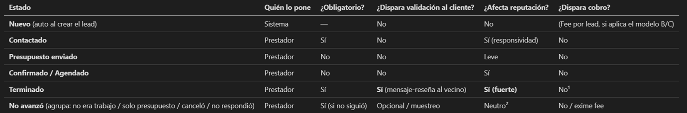

# MrServicios (Etapa 2)

_El siguiente documento detalla la nueva etapa de MrServicios, tanto del modelo de negocio como del nuevo flujo de interacción entre vecinos y prestadores, así como también la escalabilidad a otros barrios privados._ 

---

## Puntos clave

- Ideas Generales
- Fases del Modelo actualizado
- Flujos: Vecino y Prestador
    - Vecino
    - Prestador
- Sistema de Estados
- Sistema de Incentivos y Sanciones
    - Beneficios por incumplir
    - Penalizaciones por incumplir
- Estrategia para ser la APP oficial del barrio San Isidro
- Propuesta de Alianza con admin
- Monetización
- Precio mensualidad
- Mensajes

### Ideas Generales
- La confirmación del cliente tiene que venir disfrazada de algo que él ya quiere hacer: dejar una reseña.
- Implicancia estratégica: su métrica del año no es "usuarios totales" ni "GMV", es "% de hogares de San Isidro que nos usan" y "% de servicios del barrio que pasan por MrServicios".
- Membresía mensual una vez que vemos que tiene un flujo constante de clientes. Puede ser 1er mes gratis, a partir del segundo si quieren figurar se paga, al 50% de su valor mientras se mantengan presentes en la pagina. Si deciden salirse de la pagina y luego quieren aparecer, se les cobra el 100% de su valor (se perdieron la oportunidad de pagar nuestro servicio por el 50%)
- Se puede pagar un extra por aparecer primero, perfil destacado o etiqueta/insignia "TOP". Que vaya acompañado de las reseñas, no solo por pagar, puede ser tambien contar la cantidad de reservas que tuvo o hace cuanto esta en la pagina.
- Codigo de cierre de trabajo, el vecino recibe un codigo y el prestador lo indica en la pagina, de esta manera ambos confirman que se realizo el trabajo y se cobra la comision. 
- Cuando el prestador marca "terminado" se le pide reseña al cliente.
- No actualizar los estados o mentir hace que se lo baje automaticamente de la pagina, con un fee de reactivacion para volver a aparecer.

### Fases del Modelo actualizado
**Fase 0 – Gratis (siembra):** listado y leads gratis para los prestadores. Objetivo: liquidez y volverse "la app del barrio". Registramos cuántos leads reales generan por prestador → esa data es su argumento de venta.
**Fase 1 – Membresía:** una vez que un prestador recibió, digamos, ≥3-5 contactos reales, se le propone la membresía para seguir listado/activo. "Te trajimos X contactos este mes; para seguir recibiéndolos, la cuota es Y".
**Fase 2 – Mixto (E):** membresía baja + fee por lead calificado o destacados (F), cuando la relación ya está madura.

### Flujos: Vecino y Prestador
#### Vecino
1. Entra a MrServicios (web/app), idealmente desde un link que circula en los grupos del barrio o con aval de la administración.
2. Busca el servicio ("plomero", "jardinero"…) o navega por categoría.
3. Ve prestadores con foto, categoría, insignia de verificado, estrellas y reseñas de otros vecinos de San Isidro.
4. Compara por reputación, cantidad de trabajos, cercanía.
5. Elige y toca "Contactar por WhatsApp" → se abre WhatsApp con un mensaje pre-armado ("Hola, te contacto desde MrServicios por [servicio]…"). En ese click, ustedes crean la solicitud/lead en su base.
6. Conversa y arregla con el prestador por WhatsApp (como ya hace hoy).
7. Seguimiento mínimo: no recibe nada… hasta que el prestador marca "terminado".
8. Confirma + califica: recibe un mensaje: "¿Cómo te fue con [prestador]? Calificá 👇". Toca estrellas + comentario opcional. Eso confirma el trabajo y alimenta la reputación.
9. Listo. La próxima vez vuelve porque fue rápido, confiable y "es la app del barrio".

Principio de diseño: el vecino hace 2 acciones (contactar y calificar) y nada más. Todo lo demás es invisible para él.

#### Prestador
1. Recibe la solicitud: mensaje de WhatsApp de MrServicios: "📩 Nuevo contacto de [Nombre], vecino de San Isidro — [servicio]. Te va a escribir. Actualizá el estado acá 👉 [link único]".
2. Abre el link único del trabajo (una página web simple, sin contraseña, con token en la URL). Ve datos básicos del vecino y del pedido.
3. Actualiza estado con un toque: botones grandes (Contactado / Presupuesto enviado / Confirmado / Terminado / No avanzó).
4. Al marcar "Terminado": se dispara el mensaje de reseña al vecino (validación cruzada) y suma a su historial.
5. Reputación: responder rápido + completar trabajos + buenas reseñas = sube en el ranking, insignia de confiabilidad, perfil destacado.
6. Cobro (cuando aplique): si está en membresía, paga su cuota mensual por link de MercadoPago; si es por lead, recibe el link al generarse el contacto calificado.
7. Sanción por incumplir: si no actualiza estados o acumula malas reseñas/quejas → baja de ranking, advertencia, y en casos graves suspensión.

### Sistema de Estados
Menos es más. Nueve estados confunden. Propongo 5 visibles + 1 automático:

¹ En el modelo recomendado (membresía), "terminado" NO cobra → por eso el prestador no tiene incentivo a ocultarlo. Si algún día usan comisión por trabajo, recién ahí "terminado" cobraría (y necesitarían escrow para que sea creíble). ² "No avanzó" no castiga por sí solo (es normal que no todo cierre), pero si el vecino, al ser consultado por muestreo, dice "sí se hizo" y el prestador marcó "no avanzó" → eso sí penaliza fuerte (mentira detectada).

### Sistema de Incentivos y Sanciones
#### Beneficios por cumplir: 
- **Mejor Ranking** -> aparece primero en su categoría.
- **Perfil destacado / insignia "Prestador confiable de San Isidro"**.
- **Historial positivo** acumulado que un competidor nuevo no puede copiar.
- **Posible estado destacado por buena conducta** respondiendo rápido y sin quejas.

#### Penalizaciones por incumplir:
- **Recordatorio amable** (no actualizó un estado).
- **Advertencia** (patrón de no responder / no cerrar / reseñas malas).
- **Baja de visibilidad / ranking** (cae al final de la lista).
- **Suspensión temporal** del perfil.
- **Baja definitiva** (fraude comprobado, riesgo para vecinos, mentir estados de forma sistemática).

### Estrategia para ser la APP oficial de San Isidro
#### Qué problema resolvemos al barrio:
- Hoy el ingreso de prestadores al barrio es caótico y difícil de controlar (seguridad en la entrada, gente desconocida circulando). MrServicios ordena y da trazabilidad de quién entra, para qué casa y con qué reputación.
- Reduce el ruido en los grupos oficiales de WhatsApp ("¿alguien conoce un plomero?" x50 por semana).

#### Beneficios para los vecinos:
- Prestadores con referencias reales de otros vecinos -> menos riesgo de estafa/mala experiencia.
- Rapidez y una sola fuente confiable.

#### Beneficios para la adminstración:
- **Seguridad:** prestadores verificados (DNI, referencias), lista conocida de quién presta servicios en el barrio.
- **Orden:** un canal formal en vez del desorden de los grupos.
- **Datos/Reportes:** servicios más demandados, prestadores mejor valorados, quejas. Útil para la gestión del barrio.
- **Cero costo** para la administración.

#### Cómo validamos prestadores
- Verificación de identidad (DNI), referencias de vecinos, y para ciertos rubros (gas, electricidad) matrícula/seguro cuando corresponda.
- Insignia "Verificado" ligada a esa validación.

#### PROPUESTA DE ALIANZA
1. **Recomendación:** la administración difunde MrServicios en sus canales oficiales.
2. **Validación:** la administración co-valida prestadores (aporta su lista de "conocidos/confiables") → sello conjunto.
3. **Oficialidad:** MrServicios es el **canal oficial de prestadores de San Isidro**, integrado (idealmente) al proceso de ingreso/seguridad.

### Monetización
- **Vecino: siempre gratis.**
- **Prestador:**
    - **Plan gratis (Fase 0 / siempre para probar):** perfil básico, recibe leads, aparece al final del ranking.
    - **Plan activo (membresía mensual):** aparece en el ranking normal, insignia de verificado, panel de leads. **Este es el ingreso principal.**
#### Precio de mensualidad
Para el precio deberíamos poner algo que con un solo trabajo promedio como prestador ya lo puedan cubrir. Ejemplo: $10.000 / $15.000 pesos. El único que no lo cubre con un solo trabajo es el lavado de autos, el resto todos.

### Mensajes
#### Al prestador
"Hola [Nombre], somos [nombres], dos vecinos de San Isidro. Armamos MrServicios, la plataforma donde los vecinos del barrio buscan prestadores de confianza.

Te queremos sumar porque nos hablaron bien de tu laburo. ¿Cómo funciona? • Los vecinos te encuentran y te escriben directo por WhatsApp. Nosotros no nos metemos en el trabajo ni en el precio: eso lo arreglás vos con el cliente, como siempre. • Probalo gratis. Si te trae clientes, después seguís con una cuota chica. Si no te sirve, no pagás nada. • Cuando te llega un contacto, te mandamos un link para que marques en qué estado está el trabajo. Te toma menos de un minuto y te sirve a vos: mientras más al día tenés tu perfil y mejores reseñas juntás, más arriba aparecés y más clientes te llegan. • Todo se maneja por WhatsApp y links. No tenés que descargar ninguna app ni recordar contraseñas.

La idea es que sea justo para todos: vos conseguís clientes reales del barrio, y los vecinos consiguen gente de confianza."

#### Al Vecino
"¿Cansado de preguntar en el grupo '¿alguien conoce un plomero?' y esperar que alguien conteste?

MrServicios es la app de servicios de San Isidro. Entrás, buscás lo que necesitás (plomero, electricista, jardinero, piletero, lo que sea) y ves a los prestadores que otros vecinos ya recomendaron, con sus reseñas y valoraciones.

Elegís, lo contactás por WhatsApp en un toque, y listo. Gratis. Después contás cómo te fue con una reseña, y ayudás al resto de los vecinos a elegir mejor.

Prestadores de confianza, con referencias reales del barrio, todo en un solo lugar."

#### Mensajes de WhatsApp sugeridos:
a) Avisar al prestador que recibió una solicitud:

"📩 ¡Nuevo contacto en MrServicios! [Nombre], vecino/a de San Isidro, busca [servicio]. Te va a escribir por acá. Podés ver los datos y marcar el estado del trabajo acá 👉 [link]"

b) Mandarle el link para actualizar estado:

"Para llevar el control de este trabajo (y sumar reputación), marcá el estado con un toque 👉 [link]. Te lleva menos de un minuto 🙌"

c) Recordatorio amable de actualizar estado:

"Hola [Nombre] 👋 Vimos que tenés un trabajo con [vecino] sin actualizar. Cuando puedas, marcá cómo va acá 👉 [link]. Tener el perfil al día te ayuda a aparecer más arriba y recibir más contactos 📈"

d) Pedir confirmación al cliente sin ser pesado (= reseña):

"¡Hola [Nombre]! 😊 ¿Cómo te fue con [prestador]? Dejá tu opinión en 10 segundos y ayudá a otros vecinos a elegir mejor 👉 [link] ⭐⭐⭐⭐⭐"

e) Pedir la reseña (recordatorio suave, si no respondió):

"Hola [Nombre] 👋 Si tuviste un rato, tu reseña sobre [prestador] le sirve un montón al resto del barrio 🙏 [link]. ¡Gracias!"

f) Avisar al prestador que debe pagar (membresía):

"Hola [Nombre] 🙌 Este mes MrServicios te acercó [N] contactos de San Isidro. Para seguir activo y visible, tu cuota es [monto]. Pagás en un toque acá 👉 [link de MercadoPago]. ¡Gracias por ser parte!"

g) Advertir al prestador para conservar visibilidad:

"Hola [Nombre]. Notamos que hace varios contactos que no actualizás el estado ni sumás reseñas. Eso hace que aparezcas más abajo y te lleguen menos clientes. Mantené tu perfil al día para seguir bien rankeado 💪 Cualquier duda, escribinos."

_Última actualización: 2026-07-08_